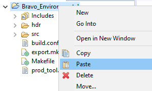

# IoT-AppZone-BravoSamples
Telit IoT AppZone Sample Apps For Bravo Board - leverage onboard sensors to OneEdge portal

## Abstract

This repository contains Telit IoT AppZone C sample apps dedicated for Bravo Board, showing how to access data from sensors and publish them with OneEdge

## Structure
All samples are inside `Samples` folder, where each one has its own subfolder, containing all the required files. **The minimum firmware version to build the samples is 30.00.xx8, but it is suggested to use the latest 30.01.xx0**.

## Usage

The master branch will always contain the latest sample apps package version. Older ones will be available through tags.

To use a specific sample app, first download the repository content by pressing the green button "Code" and selecting "Download ZIP".

**Please note: the repository can always be locally cloned using git tools. In the following description, the downloaded zip approach will be considered.**

Once downloaded, uncompress `IoT-AppZone-BravoSamples-master.zip` file.

Let's say that the **Environmental Demo** sample app on Main UART is needed. Its path inside the repository will be `BRAVO_Environment_BSEC_Demo/`.

To use it, from the AppZone IDE create a new Telit Project

Select the ME910C1 products family, the ToolChain (for example, GCC) and the required firmware version, then press **Next >**.

In the next window, leave "Empty Project" as project type, then press **Finish** button.

In the IDE Project Explorer, the newly created project will be available:

As last step, go into the repository local copy (either cloned via git or downloaded as a zip file), in this case `BRAVO_Environment_BSEC_Demo/`. Select all files and folders

then copy and paste them in the project from the IDE:

The IDE will ask the permission to overwrite existing files, press **"Yes to All"**.

Done! The project is now updated with the latest sample app source code available, and is ready to be built.

Please refer to the specific sample README.md file for additional build requirements.

### Build and Deploy

For additional info about building and deploying an application, please refer to the following links:

[Build](https://s3.amazonaws.com/site_support/Telit/AppZone-SDK/User+Guides+AppZone+2.0/az-c-m2mb-ug-r1/index.html#!Documents/buildapplications.htm)

[Deploy](https://s3.amazonaws.com/site_support/Telit/AppZone-SDK/User+Guides+AppZone+2.0/az-c-m2mb-ug-r1/index.html#!Documents/buildapplications.htm)

**Important!**

When building a project, please be sure that the module Firmware and IDE plugin versions are aligned.

---

For further info, please go on Telit's cellular modules product webpage https://www.telit.com/m2m-iot-products/cellular-modules/standard-industrial-grade/

And Bravo Board webpage
https://www.telit.com/developer-zone/telit-bravo-evaluation-kit/

AppZone development resources are available at the link https://www.telit.com/developer-zone/iot-app-zone/iot-app-zone-developer-resources/

